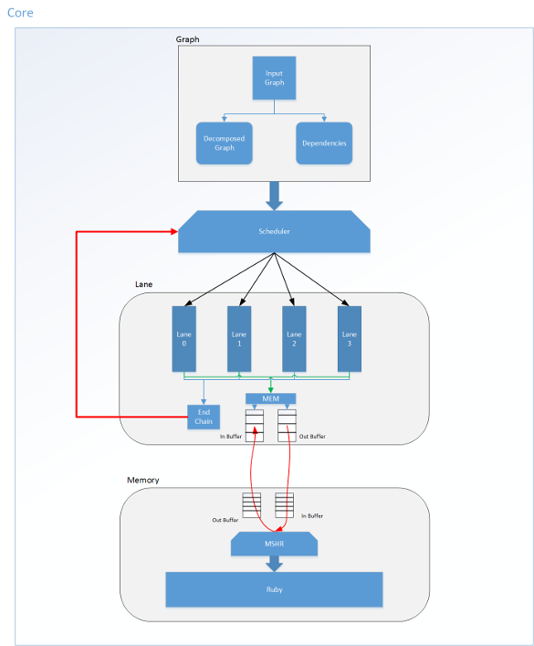

Chainsaw-Sim:   A Chain simulator
======================

Chainsaw-Sim is a cycle accurate simulator that models the host core, the 'Chainsaw' accelerator, and spatial fabrics of parameterizable size.

Dependencies
----------------------
* 1- Boost 1.55 (or higher)
* 2- CMake 2.8.8 (or higher)

Build
--------------------
0- Download boost 1.61 from [here](http://www.boost.org/users/history/version_1_61_0.html)
    * Compile boost with `regex`, `graph`, `system`, `filesystem`, `iostreams` and `program_option` libraries.
        * ./bootstrap --show-libraries (showing available boost libraries)
        * ./bootstrap.sh --prefix=`<PATH_TO_INSTALL>` --with-libraries=filesystem,graph,regex,program_options,system
        * ./b2 --prefix=`<PATH_TO_INSTALL>` -j`<number>` install

2- Compile _Simulator_ with CMake options

    a. `BOOST_ROOT`=`<boost/dir>`
    b. `CMAKE_BUILD_TYPE` = `Debug/Release`

About simulator classes
-------------------------

* Classes:
 * Core
 * Graph
 * Lane
 * Memoy
 
1- Core: Core class is parent of other classes it contains `Graph`, `Lane` and `Memory` class and also it has two imortant functions
 * Scheduling
 * Communicating between Lanes and Memory class

For schduling function it supports multiple algorithm base on input Graph. Scheduling algoirthm works base on:
 * Decomposed Graph(chains)
 * Chains' dependencies
 * Lanes' instruction buffer size

2- Graph: Graph contains multiple function to process input dot files:
 * Read/Write graph
 * Decomposing graph (here it can support multiple different implimentation of graph decomposition algorithms)
 * Finding dependencies between chains(decomposed graph)
 
3- Lane: Lane is a three stage single in order core which has (FETCH/DECODD, EXE, COMMIT) stages.
 * Each lane has an instruction buffer which during scheduling part it gets fill. Core is in reponsible to fill lanes' instruciton buffer
 * 
            
            

